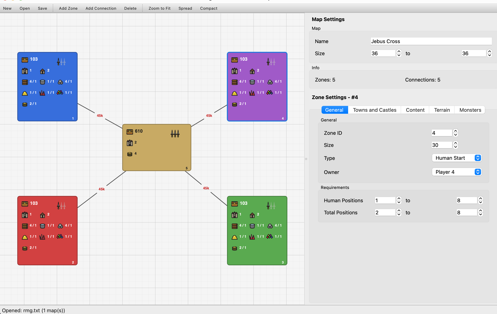

# h3tc - Heroes of Might and Magic 3 Template Converter

Convert random map generator (RMG) template packs between **SOD** (Shadow of Death) and **HOTA** (Horn of the Abyss) formats.

## Requirements

- Python 3.10+

## Installation

```bash
pip install -e .
```

## Usage

### CLI

```bash
# Convert SOD to HOTA
h3tc convert templates/sod_pack.txt output.h3t --to hota --pack-name "My Pack"

# Convert HOTA to SOD
h3tc convert templates/hota_pack.h3t output.txt --to sod

# Rewrite (normalize) a file in the same format
h3tc convert input.txt output.txt --to sod
```

Or run as a module:

```bash
python -m h3tc convert input.txt output.h3t --to hota
```

### Options

| Option | Description |
|--------|-------------|
| `--to` (required) | Output format: `sod` or `hota` |
| `--from` | Input format (auto-detected from extension: `.txt` = SOD, `.h3t` = HOTA) |
| `--pack-name` | Pack name for SOD→HOTA conversion (defaults to input filename) |

### Python API

```python
from pathlib import Path
from h3tc.parsers.sod import SodParser
from h3tc.parsers.hota import HotaParser
from h3tc.writers.sod import SodWriter
from h3tc.writers.hota import HotaWriter
from h3tc.converters.sod_to_hota import sod_to_hota
from h3tc.converters.hota_to_sod import hota_to_sod

# Parse
parser = SodParser()
pack = parser.parse(Path("template.txt"))

# Convert
hota_pack = sod_to_hota(pack, pack_name="My Pack")

# Write
writer = HotaWriter()
writer.write(hota_pack, Path("output.h3t"))
```

## Visual Template Editor

A graphical editor for SOD templates built with PySide6. View and edit zones, connections, and all template properties visually.



### Features

- Zoomable, pannable canvas with drag-to-move zones
- Zone icons showing treasure value, monster strength, castles, towns, and resource mines
- Player zones colored by player (blue, red, green, purple, etc.)
- Treasure zones colored gray or gold based on treasure richness
- Connection lines with guard values displayed as red labels
- Property panel with 5 tabs: General, Towns and Castles, Content, Terrain, Monsters
- Spread/Compact buttons to adjust zone spacing
- Force-directed auto-layout for initial zone positioning
- Layout positions saved to JSON sidecar files

### Running the editor

Install with the GUI dependency:

```bash
pip install -e ".[gui]"
```

Launch from the CLI:

```bash
# Open a template file directly
h3tc editor templates/sod_complete/Jebus\ Cross/rmg.txt

# Or launch and use File > Open
h3tc editor
```

Or run as a module:

```bash
python -m h3tc editor path/to/rmg.txt
```

## What gets converted

### SOD → HOTA

Shared fields (zone data, connections, mines, terrains, monsters, treasure) are preserved exactly. HOTA-only fields receive sensible defaults:

- **Pack metadata**: empty (name from `--pack-name` or filename)
- **Map options**: all empty
- **Town types**: Cove and Factory added (empty)
- **Terrains**: Highlands and Wasteland added (empty)
- **Monster factions**: Conflux, Cove, Factory added as enabled (`x`); Forge dropped
- **Zone options**: `placement=ground`, `monsters_disposition_standard=3`, `monsters_joining_percentage=1`, `monsters_join_only_for_money=x`
- **Connection extras**: `road=+`, `type=ground`

### HOTA → SOD

HOTA-only fields are stripped:

- Pack metadata, field counts, map options removed
- Cove, Factory town types removed
- Highlands, Wasteland terrains removed
- Conflux, Cove, Factory monster factions removed; Forge column added as `x`
- Zone options removed
- Connection road, type, fictive, portal repulsion removed

## Testing

```bash
pip install -e ".[dev]"
pytest
```

Tests validate roundtrip fidelity against 60 SOD and 36 HOTA template files.

## Project structure

```
src/h3tc/
├── cli.py              # CLI entry point
├── models.py           # Format-agnostic Pydantic data models
├── enums.py            # Faction, terrain, resource lists
├── constants.py        # Column index mappings (SOD: 85 cols, HOTA: 138 cols)
├── parsers/
│   ├── sod.py          # SOD format parser
│   └── hota.py         # HOTA format parser
├── writers/
│   ├── sod.py          # SOD format writer
│   └── hota.py         # HOTA format writer
├── converters/
│   ├── sod_to_hota.py  # SOD → HOTA conversion
│   └── hota_to_sod.py  # HOTA → SOD conversion
└── editor/             # Visual template editor (PySide6)
    ├── __init__.py     # launch() entry point
    ├── main_window.py  # Main window, toolbar, panels
    ├── constants.py    # Visual constants (colors, sizes, zoom)
    ├── canvas/
    │   ├── view.py     # Zoomable/pannable QGraphicsView
    │   ├── scene.py    # Zone/connection item management
    │   ├── zone_item.py    # Zone rendering with icons
    │   ├── connection_item.py  # Connection lines with labels
    │   ├── layout.py   # Force-directed auto-layout
    │   └── icons.py    # Vector icon drawing (QPainter)
    ├── panels/
    │   ├── zone_panel.py       # Zone property editor (5 tabs)
    │   ├── connection_panel.py # Connection property editor
    │   ├── map_panel.py        # Map name/size panel
    │   ├── map_selector.py     # Multi-map pack selector
    │   └── binding.py          # Widget ↔ model data binding
    └── models/
        ├── editor_state.py     # Editor state tracking
        └── layout_store.py     # JSON sidecar for positions
```

## Format details

See [docs/format_reference.md](docs/format_reference.md) for a detailed column-by-column reference of both formats.
